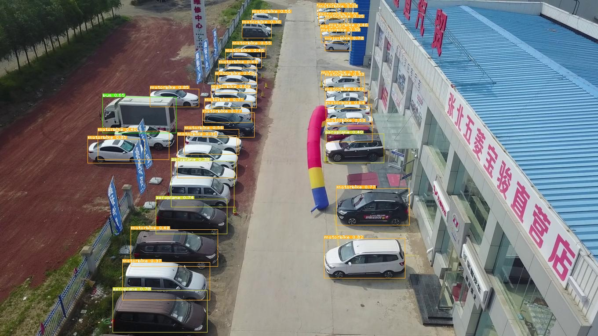
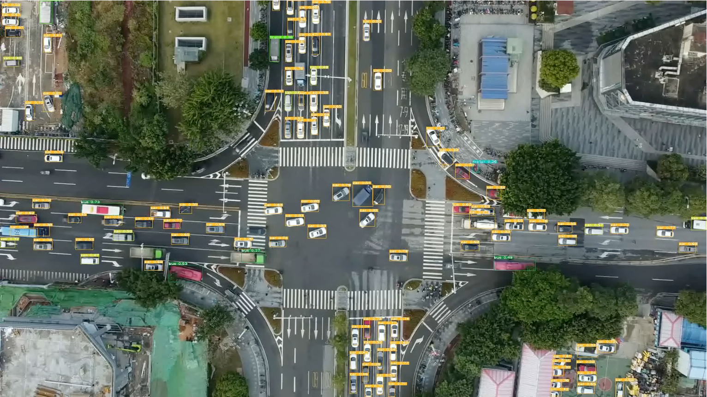

## Introdution

Deploy ultralytics [Yolov5](https://github.com/ultralytics/yolov5.git) pretained model with OpenCV CUDA and C++.


## Environment:

1. GCC 7.5
2. Opencv 4.5.4


## Get ONNX Model 

1. go to  yolov5 [release page](https://github.com/ultralytics/yolov5/releases) download yolov5 pretrained model（official onnx can't work right)，such as yolv5s.pt

2. use`trace.py` convert yolov5s.pt to yolov5.onnx:

    ```bash
    git clone https://github.com/ultralytics/yolov5.git
    cd yolov5
    python3.7 export.py --data data/coco128.yaml --weights yolov5s.pt --include onnx
    ```


## Compile OpenCV

Refer to [OpenCV Compile](Jetson Xavier NX OpenCV Compile.md).


## Build 

```bash
git clone https://github.com/Hexmagic/ONNX_yolov5.git
mkdir build&&cd build
cmake ..
make -j4
cd ..
./build/main yolov5s.onnx data/images/zidane.jpg
```


## Inference Image Demo

<div align="center">

</div>
<div align="center">

</div>


## Inference Video Demo

<video controls autoplay name="media"><source src="assets/result_1.mp4" type="video/mp4"></video>


## Thanks For:

https://github.com/Hexmagic/ONNX-yolov5.git
